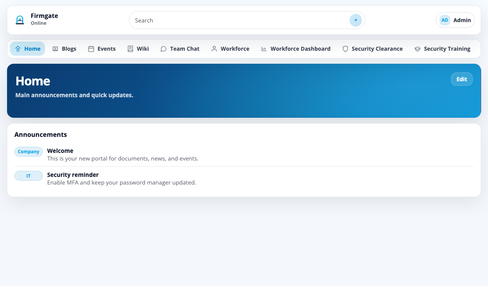
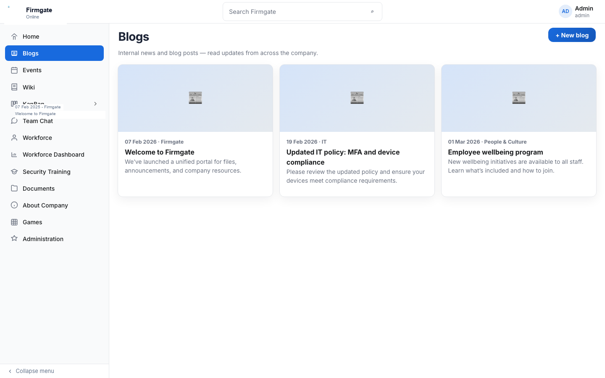
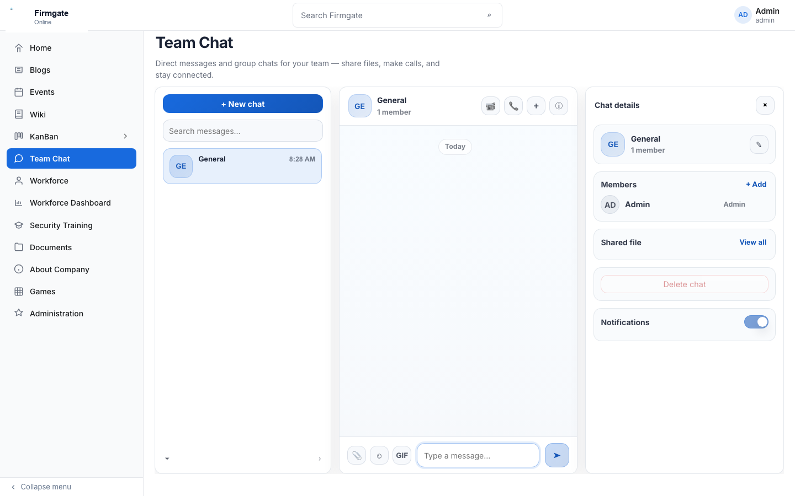
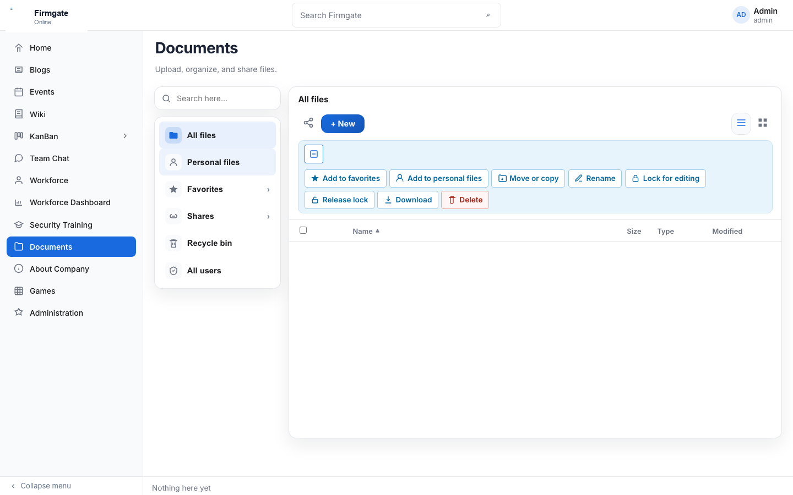
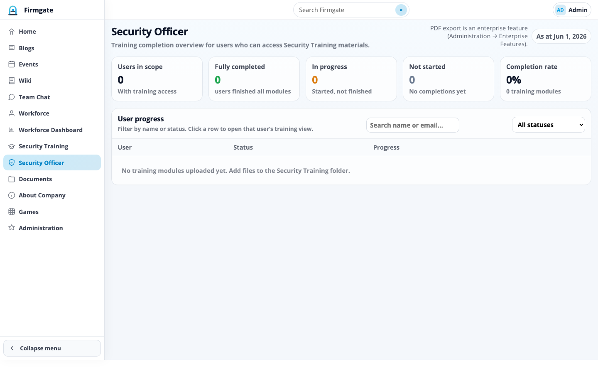
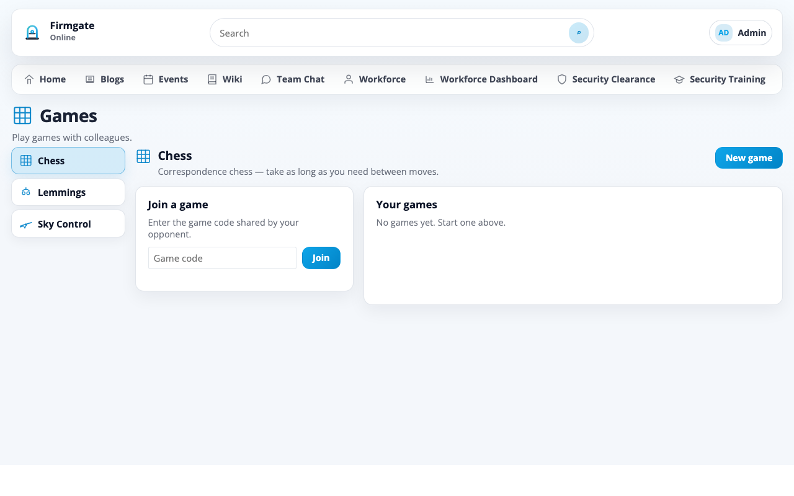
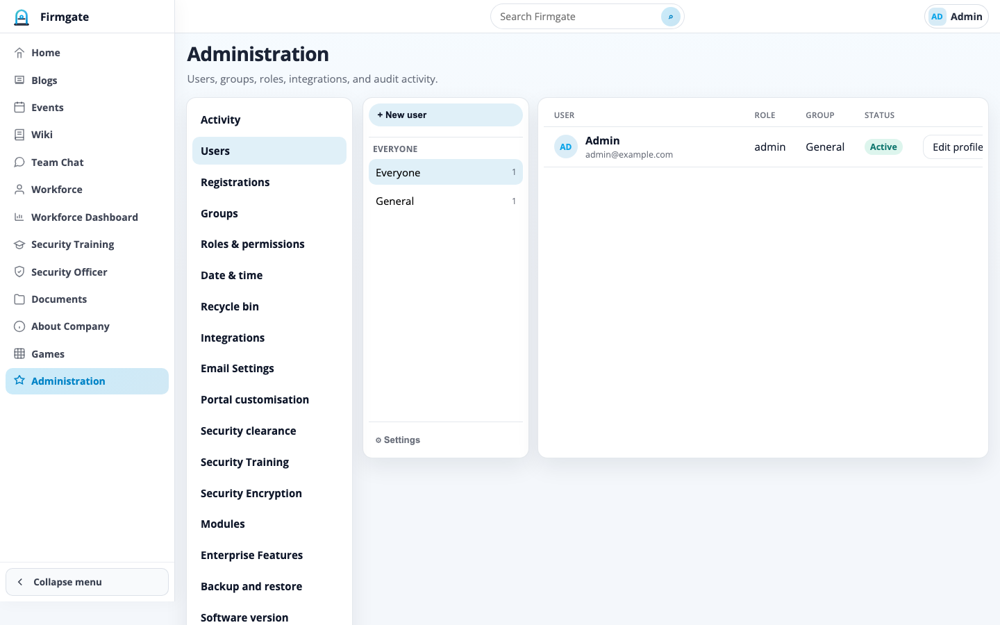
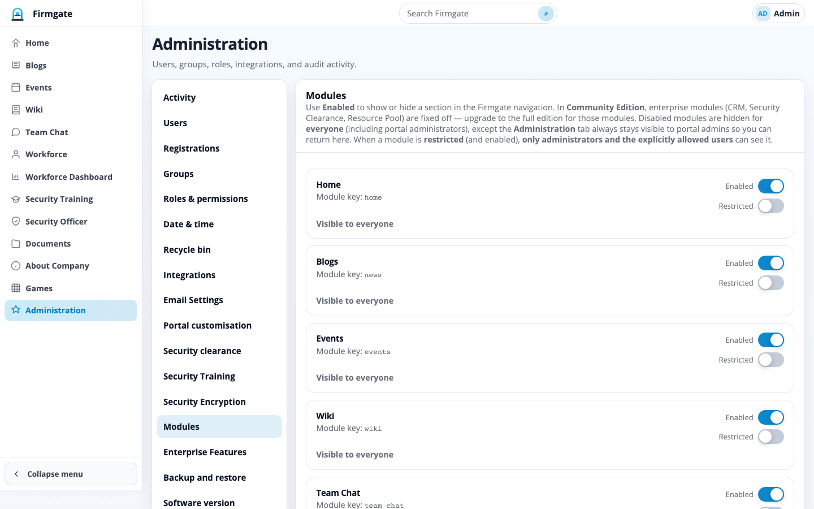

# Firmgate

**Self-hosted intranet for teams** — news, wiki, chat, documents, workforce directory, and security workflows in one stack you run on **your** hardware. No mandatory SaaS, no per-seat cloud tax.

> **This GitHub repository contains Community Edition only.**  
> It does not include enterprise application code (`app/enterprise/`), CRM, Security Clearance, Resource Pool, AI assistants, or Microsoft 365 / LDAP integrations.  
> To **upgrade to Enterprise Edition**, you need a **separate codebase** from your supplier plus a **vendor-issued licence key** — see [Upgrading to Enterprise Edition](#upgrading-to-enterprise-edition) below.

This tree is **Firmgate Community Edition** — open source under [Apache 2.0](LICENSE). It ships a focused module set for internal portals.



---

## Community Edition at a glance

Community Edition is the default when `COMMUNITY_EDITION=1` (see [`.env.example`](.env.example)). The app enforces a **fixed module allowlist** — enterprise modules are not present in this repository and cannot be enabled from the UI.

### Included modules (Community Edition)

| Module | Description |
|--------|-------------|
| **Home** | Configurable landing page and announcements |
| **Blogs** | Internal posts (admin authoring) |
| **Events** | Shared calendar (day / month / year), public holidays |
| **Wiki** | Knowledge base with sanitised HTML |
| **Team Chat** | Rooms, messaging, optional WebRTC / Jitsi voice |
| **Workforce** | Employee directory, presence, admin editing |
| **Workforce Dashboard** | Workforce metrics and views |
| **Security Training** | Training content library |
| **Security Officer** | Security dashboard (PDF export is Enterprise Edition only) |
| **Documents** | Folders, uploads, sharing, viewers, OnlyOffice when configured |
| **About Company** | Editable company profile |
| **Games** | Chess, Lemmings, Sky Control |
| **Administration** | Users, groups, roles, modules, backups, branding |

### Enterprise Edition (not in this repository)

The following are part of the **commercial Enterprise Edition** — a **separate codebase** from your supplier, not this GitHub tree:

| Module / capability | Description |
|---------------------|-------------|
| **CRM** | Leads, pipeline, companies, contacts, activities |
| **Security Clearance** | Clearance records, import/export, compliance summaries |
| **Resource Pool** | Resource and CV pool workflows |
| **AI assistants** | Document search, chatbot, policy / CV / tender assistants |
| **Microsoft 365** | Office Online document editor |
| **LDAP** | Active Directory / LDAP integration |
| **Other add-ons** | Self-registration, security encryption, officer PDF export, etc. |

Enterprise features require both the **enterprise application package** and a **valid FG2 licence key** from your supplier. A licence key alone does not turn this Community Edition clone into Enterprise.

Commercial terms: [COMMERCIAL.md](COMMERCIAL.md).

---

## Upgrading to Enterprise Edition

If you are running Community Edition from this repository and want Enterprise capabilities:

1. **Contact your supplier** for:
   - An **Enterprise Edition release package** (application ZIP with `app/enterprise/` and related assets), and  
   - A **licence key** (FG2 format) for the features you purchased.
2. **Deploy the enterprise codebase** on your server (package upgrade via **Administration → Software version**, or a fresh install). This is **not** a `git pull` from this public repo — the enterprise code is distributed separately.
3. **Apply your licence key** under **Administration → Enterprise Features** on the enterprise build.
4. **Keep your data:** on the same server, a package upgrade usually preserves `instance/` (database and uploads). When moving to a new host, download a backup on Community Edition and restore it on the Enterprise deployment (see below).

**Community Edition backup → Enterprise:** A Community Edition backup can be restored into an Enterprise deployment. The backup is **runtime data** (database, uploads, branding), not application code, and both editions use the **same backup format**.

This open-source repository remains Community Edition only and will not receive enterprise module source code.

---

## Why self-hosted?

| Benefit | What it means |
|---------|----------------|
| **Your infrastructure** | SQLite (default), uploads, and config stay on **your** servers |
| **One system** | Intranet, documents, workforce, and compliance tools in one deployable app |
| **Air-gap friendly** | LAN, VPN, or regulated networks where data must not leave the site |
| **Apache 2.0** | Use and modify Community Edition freely; optional paid support is separate |
| **Full admin control** | Users, roles, modules, backups, factory reset, and branding from **Administration** |

---

## Screenshots

Gallery captured from Community Edition (`COMMUNITY_EDITION=1`). Regenerate after UI changes:

```bash
python run.py   # http://127.0.0.1:5001
python3 -m pip install playwright && python3 -m playwright install chromium
python3 scripts/capture_readme_screenshots.py
python3 scripts/update_readme_screenshots.py   # optional branding pass
```

### Home

Configurable landing page with announcements and hero content.


### Blogs

Internal posts with categories; permitted authors can publish new entries.



### Events

Shared calendar with day, month, and year views.


### Wiki

Internal knowledge base with rich text and page navigation.


### Team Chat

Chat rooms, members, attachments, and optional voice calls.



### Documents

Folder tree, uploads, sharing, favourites, and in-browser previews.



### Workforce

Employee directory with search, tags, and presence.


### Security Officer

Security operations dashboard (Community Edition; PDF export is a licensed add-on).



### Games

Built-in games for informal team engagement.



### Administration

User management, roles, integrations, backups, and module toggles.





---

## Requirements

### Server / development machine

| Requirement | Notes |
|-------------|--------|
| **Python 3.10+** | 3.11 recommended |
| **Git** | Clone and deploy updates |
| **SQLite** | Default database (bundled with Python) |
| **Disk space** | Depends on document uploads (`UPLOAD_ROOT`) |
| **Docker** (optional) | Docker Engine + Compose v2 for container deploy |

### Python dependencies

```bash
pip install -r requirements.txt
```

Production also uses **Gunicorn** (installed by `scripts/update.sh` if missing).

### Optional (by feature)

| Feature | What you need |
|---------|----------------|
| **HTTPS reverse proxy** | nginx, Caddy, or similar (strongly recommended in production) |
| **OnlyOffice** | Document Server + reachable callback URL (Community Edition) |
| **Microsoft 365 editing** | Enterprise Edition only (Azure app + supplier licence) |
| **Outbound email** | SMTP (custom, Microsoft 365, or Google Workspace) |
| **LDAP / AD** | Enterprise Edition only (directory server + supplier licence) |
| **Large uploads** | `MAX_UPLOAD_MB` and proxy `client_max_body_size` |

---

## Default administrator (factory bootstrap)

On a **fresh install** (empty database):

| Field | Value |
|-------|--------|
| **Email** | `admin@example.com` |
| **Password** | `admin` |

**Change this password before production.**

Once **any other active user** has `admin.all`, the bootstrap account is **automatically deactivated**. **Factory reset** restores the same credentials on a wiped portal.

---

## Install in minutes

Clone the repository, set a secret key, and run with **Docker Compose** — or use a [release ZIP](#release-zip-air-gapped-servers) for air-gapped servers.

1. Copy `.env.example` to `.env` and set `SECRET_KEY`
2. Run `docker compose up -d --build`
3. Open the portal and sign in with the factory bootstrap admin
4. Create your real administrator and change passwords before production

**Default bootstrap** (fresh install only): `admin@example.com` / `admin` — deactivated automatically once another admin exists.

### Docker Compose (recommended)

```bash
git clone https://github.com/snooth/firmgate.git
cd firmgate
cp .env.example .env
# Set SECRET_KEY (openssl rand -hex 32)
docker compose up -d --build
```

Open **http://127.0.0.1:5001/** (or the host port from `FIRMGATE_HTTP_PORT` in `.env`). Put **nginx** or **Caddy** in front for HTTPS in production.

| Item | Location |
|------|----------|
| App | `firmgate` container |
| Database + uploads | Docker volume `firmgate_data` → `/data/instance` |
| Secrets | `.env` on the host |

### Local development

```bash
python3 -m venv .venv
source .venv/bin/activate   # Windows: .venv\Scripts\activate
pip install -r requirements.txt
cp .env.example .env        # set SECRET_KEY; COMMUNITY_EDITION=1 is the default
python run.py
# http://127.0.0.1:5001/
```

Optional: `python seed_data.py` on an empty database (bootstrap admin only, no demo data).

### Release ZIP (air-gapped servers)

Community Edition release packages can be built from this tree with `scripts/build_release_package.sh` (maintainer workflow). **Enterprise release packages** are supplied by your vendor and include the full application with `app/enterprise/`.

**First install:** unzip on the server, create `.env`, virtualenv, `pip install -r requirements.txt`, run Gunicorn ([production deployment](#production-deployment-start-to-finish)).

**In-place upgrade (same edition):** **Administration → Software version → Upgrade from package** when `ENABLE_SOFTWARE_PACKAGE_UPGRADE=1`. Use an enterprise package from your supplier to move from Community Edition to Enterprise — not a package built from this public repository alone.

---

## Using the application

### Navigation (Community Edition)

After sign-in, the sidebar lists modules enabled for your account. Community Edition never shows **CRM**, **Security Clearance**, or **Resource Pool** in the nav.

Typical end-user flow:

1. **Home** — announcements  
2. **Documents** — files and sharing  
3. **Events** / **Wiki** / **Team Chat** — collaboration  
4. **Workforce** — find colleagues  

### Roles and permissions

Built-in roles include **Standard**, **Power**, and **admin**. Fine-grained permissions are under **Administration → Roles & permissions**. **Groups** grant roles in bulk.

### Administration

| Section | Purpose |
|---------|---------|
| **Users / Groups / Roles** | Accounts and access |
| **Registrations** | Approve Extranet self-sign-ups (licensed add-on) |
| **Integrations** | OnlyOffice (Community Edition) |
| **Email Settings** | Outbound SMTP |
| **Portal customisation** | Logo, theme, home content |
| **Modules** | Show/hide Community Edition nav items |
| **Backup and restore** | Download backup, restore, factory reset |
| **Software version** | Git or package upgrade |

### Documents and editing

- Upload via **Documents** or drag-and-drop  
- **OnlyOffice** works in Community Edition when configured  
- **Microsoft 365** requires an enterprise license  
- PDFs, images, and `.eml` use built-in viewers  

### End-user documentation

[`docs/User_Manual.html`](docs/User_Manual.html) — regenerate figures with `scripts/generate_manual_figure_images.py` and `scripts/build_user_manual_docx.py`.

---

## Production deployment (start to finish)

```
Internet → nginx (TLS) → Gunicorn → Flask
                              ↓
                    instance/ (SQLite + uploads)
                    .env (secrets)
```

Recommended layout:

| Path | Purpose |
|------|---------|
| `/root/intranet` | Git checkout (application code) |
| `/root/intranet_instance` | Database + uploads (symlink as `instance/`) |
| `/root/intranet-backups` | Pre-upgrade backups |

### Steps (summary)

1. Install Python 3, git, nginx  
2. Clone `https://github.com/snooth/firmgate.git`  
3. Symlink external `instance/`  
4. Create `.env` with `SECRET_KEY`, `FLASK_DEBUG=0`, `DATABASE_URL`, `UPLOAD_ROOT`, `COMMUNITY_EDITION=1`  
5. `python3 -m venv .venv && pip install -r requirements.txt gunicorn`  
6. Initialise DB: `.venv/bin/python -c "from app import create_app; create_app()"`  
7. systemd unit running Gunicorn on `127.0.0.1:5001`  
8. nginx TLS reverse proxy with large `client_max_body_size`  
9. Sign in, create real admin, configure integrations  

Example systemd and nginx blocks are unchanged from prior releases — see git history or your vendor runbook if you need the full snippets.

Install the server update helper:

```bash
sudo cp /root/intranet/scripts/root-update.sh /root/update.sh
sudo chmod +x /root/update.sh
```

---

## Updating production

**Server:**

```bash
sudo /root/update.sh
```

---

## Configuration

| Variable | Purpose | Default |
|----------|---------|---------|
| `SECRET_KEY` | Flask sessions | `dev-change-me-in-production` |
| `COMMUNITY_EDITION` | Enforce CE module allowlist | `1` |
| `FIRMGATE_LICENSE_PUBLIC_KEY` | Optional override for FG2 license verification (base64) | (uses `app/enterprise_license_public.b64`) |
| `DATABASE_URL` | SQLAlchemy URI | `sqlite:///instance/secure_browser.db` |
| `UPLOAD_ROOT` | Document storage | `instance/uploads` |
| `MAX_UPLOAD_MB` | Max upload size | `4096` |
| `PORT` | Dev server port | `5001` |
| `ONLYOFFICE_APP_URL` | Callback base URL for Document Server | (request root) |
| `ENABLE_SOFTWARE_GIT_UPGRADE` | Admin Git upgrade | enabled |
| `ENABLE_SOFTWARE_PACKAGE_UPGRADE` | Admin ZIP upgrade | enabled |

See [`config.py`](config.py) and [`.env.example`](.env.example) for the full list.

---

## Integrations

Configure under **Administration → Integrations**.

- **OnlyOffice** — available in Community Edition when Document Server is configured  
- **Microsoft 365** — requires enterprise license  
- **LDAP** — requires enterprise license  
- **Email** — SMTP under **Email Settings**  

---

## Backup and factory reset

**Administration → Backup and restore**

| Action | Effect |
|--------|--------|
| **Download backup** | Zip of database, uploads, branding |
| **Restore** | Replace from zip (destructive) |
| **Factory reset** | Wipe portal; restore bootstrap admin |
| **Add demo data** | Sample content (~20% per module) |

Backups are edition-agnostic runtime data: a zip created on Community Edition can be restored on an Enterprise deployment (and vice versa), as long as the target install uses the same backup format.

Factory reset requires typing `FACTORY RESET`. If the database file is locked, stop extra workers and retry; the server can fall back to an in-place schema wipe.

---

## Troubleshooting

| Symptom | What to check |
|---------|----------------|
| **CRM / AI / Clearance missing from nav** | Expected — this repo is Community Edition only; contact your supplier for Enterprise |
| **Enterprise features still locked** | Enterprise **codebase** + valid **FG2 licence** from supplier required |
| **Cannot sign in as bootstrap** | Use real admin or factory reset |
| **Upload HTTP 413** | `MAX_UPLOAD_MB` and nginx body size |
| **OnlyOffice won’t save** | App URL reachable from Document Server |
| **Factory reset fails** | Stop Gunicorn/reloader workers; retry |
| **Package upgrade rejected** | ZIP must include `firmgate/manifest.json` |

---

## Repository layout

```
app/                 Flask application
config.py            Defaults
run.py               Dev entrypoint / Gunicorn target
requirements.txt     Dependencies
scripts/             Build, update, screenshot, sync helpers
docs/screenshots/    README gallery (Community Edition)
instance/            Runtime data (gitignored)
LICENSE              Apache 2.0
COMMERCIAL.md        Optional commercial terms
```

---

## Maintainer notes (full workspace only)

This section applies to the **private maintainer workspace**, not the published GitHub tree.

| Folder | Contents |
|--------|----------|
| **`PUBLIC/`** | Community Edition export for GitHub (`README.public.md` → `README.md`) |
| **`ENTERPRISE/`** | Full application including `app/enterprise/` |
| **`PRIVATE/`** | Licence signing, release ZIPs, secrets |

```bash
./sync.sh                  # rebuild ENTERPRISE/, PUBLIC/, and PRIVATE/
./gitpush.sh "message"     # push PUBLIC/ to GitHub
```

See **`PRIVATE/AGENTS.md`** for maintainer workflow.

---

## Tech stack

- **Backend:** Flask, Flask-Login, Flask-SQLAlchemy  
- **Database:** SQLite (default)  
- **Frontend:** Jinja2, vanilla JavaScript, Turbo Drive  
- **Production:** Gunicorn + nginx  

---

## License

**Community Edition** is licensed under the [Apache License 2.0](LICENSE).

Optional support, hosting, and enterprise offerings are described in [COMMERCIAL.md](COMMERCIAL.md).
