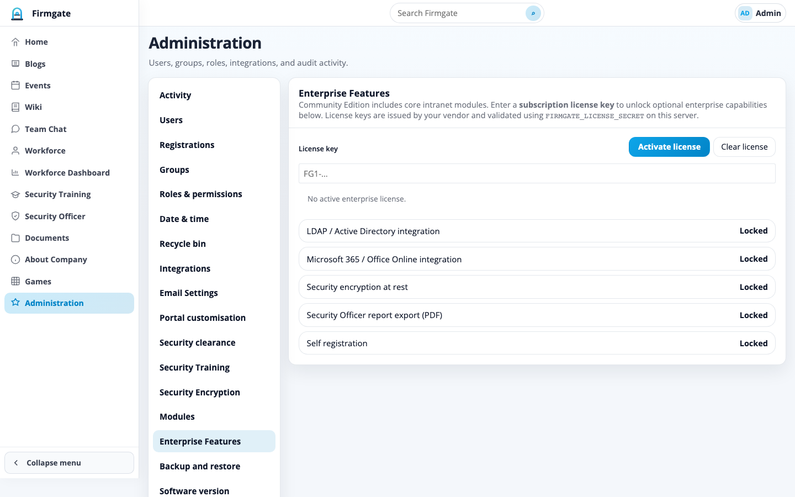

# Firmgate

**Self-hosted intranet for teams** — news, wiki, chat, documents, workforce directory, CRM, compliance workflows, and optional AI assistants in one stack you run on **your** hardware. No mandatory SaaS, no per-seat cloud tax.

Firmgate ships in two editions:

| Edition | Source | Licence |
|---------|--------|---------|
| **Community Edition** | [GitHub — open source](https://github.com/snooth/firmgate) | [Apache 2.0](LICENSE) |
| **Enterprise Edition** | Vendor release package (`app/enterprise/`) | FG2 subscription key from your supplier |


---

## At a glance

| Capability | Community Edition | Enterprise Edition |
|------------|-------------------|---------------------|
| Home, blogs, events, wiki, chat | ✓ | ✓ |
| Workforce directory & dashboard | ✓ | ✓ |
| Documents + OnlyOffice | ✓ | ✓ |
| Security training | ✓ | ✓ |
| Games, about company, admin | ✓ | ✓ |
| CRM, resource pool, casual calculator | — | ✓ (licensed) |
| Security clearance & security officer | — | ✓ (licensed) |
| Timesheets | — | ✓ (licensed) |
| AI assistants (search, chatbot, policy, CV, tender) | — | ✓ (licensed) |
| Microsoft 365 editing, LDAP, self-registration | — | ✓ (licensed) |
| Security encryption at rest, officer PDF export | — | ✓ (licensed) |

Community Edition is the default when `COMMUNITY_EDITION=1` (see [`.env.example`](.env.example)). Enterprise modules require both the **enterprise codebase** and a valid **FG2 licence key** under **Administration → Enterprise Features**.

Commercial terms: [COMMERCIAL.md](COMMERCIAL.md).

---

## Modules and functions

### Community Edition modules

These modules are included in the open-source tree and appear in the sidebar when enabled under **Administration → Modules**.

| Module | What it does |
|--------|----------------|
| **Home** | Configurable landing page — hero banner, announcement cards, quick links, and “at a glance” stats edited by admins. |
| **Blogs** | Internal news posts with categories; admins (or permitted authors) create and publish articles. |
| **Events** | Shared calendar with **day**, **month**, and **year** views; supports public holidays and team events. |
| **Wiki** | Knowledge base with sanitised HTML pages, sidebar navigation, search, and versioned content. |
| **Team Chat** | Chat **rooms**, member lists, file attachments, unread badges, and optional **WebRTC / Jitsi** voice calls. |
| **Workforce** | Employee **directory** — search, tags, presence, local time, profile pages, optional photos, manager editing. |
| **Workforce Dashboard** | Workforce **metrics** and summary views for managers (when enabled). |
| **Security Training** | Training **content library** — assign and track security awareness material. |
| **Documents** | Folder tree, **upload** (drag-and-drop), **sharing**, favourites, move/copy, trash, and in-browser **previews** (PDF, images, `.eml`). **OnlyOffice** editing when Document Server is configured. |
| **About Company** | Editable **company profile** — mission, contacts, and glance figures on the intranet. |
| **Games** | Built-in **Chess**, **Lemmings**, and **Sky Control** for informal team engagement. |
| **Administration** | Full **control plane** — see [Administration](#administration) below. |

### Enterprise Edition modules

Distributed in the commercial release package. Each module is gated by an FG2 licence feature (or the **enterprise intranet pack**).

| Module | Licence feature | What it does |
|--------|-----------------|--------------|
| **CRM** | `crm` | **Dashboard**, **pipeline**, **leads** — sales workflow (companies, contacts, activities, deals planned). |
| **Resource Pool** | `resource_pool` | Contractor and CV **resource pool** — search, profiles, and allocation workflows. |
| **Casual Calculator** | `resource_calculator` | Australian **contractor daily rate** calculator — super, payroll tax, workers comp by state; printable breakdown. |
| **Security Clearance** | `security_clearance` | Clearance **records**, import/export, compliance summaries. |
| **Security Officer** | `security_officer` | Security operations **dashboard**; PDF report export with `security_officer_export`. |
| **Timesheets** | `timesheets` | **My Timesheet** entry and **Timesheet Collection** for managers. |
| **AI Document Search** | `ai_document_search` | Chat over indexed **documents** using an OpenAI-compatible LLM. |
| **AI Chatbot** | `ai_chatbot` | General-purpose **intranet chatbot** with configurable prompts and models. |
| **AI Docs and Policy** | `ai_policy_assistant` | Policy and document **Q&A** assistant. |
| **AI CV Builder** | `ai_cv_builder` | Structured **CV generation** from workforce/resource data. |
| **AI Tender Assistant** | `ai_tender_assistant` | **Tender response** drafting assistant. |

### Platform integrations (Enterprise, licensed)

| Integration | Licence feature | What it does |
|-------------|-----------------|--------------|
| **Microsoft 365 / Office Online** | `office365` | Edit Office documents in the browser via Microsoft Graph. |
| **LDAP / Active Directory** | `ldap` | Directory sync and LDAP authentication. |
| **Self registration** | `self_registration` | Extranet **self-service sign-up** with admin approval. |
| **Security encryption** | `security_encryption` | **Encryption at rest** settings for sensitive deployments. |

Licence keys use the **FG2** format (Ed25519). Paste under **Administration → Enterprise Features**. Revoked keys are blocked by fingerprint. A licence alone does not add enterprise code — you need the enterprise application package from your supplier.

---

## Screenshots

Gallery images live in [`docs/screenshots/`](docs/screenshots/). Regenerate after UI changes:

```bash
python run.py   # http://127.0.0.1:5001 — use enterprise build + licence for all shots
python3 -m pip install playwright && python3 -m playwright install chromium
python3 scripts/capture_readme_screenshots.py
python3 scripts/update_readme_screenshots.py   # optional branding pass
```

### Home

Configurable landing page with announcements and hero content.


### Blogs

Internal posts with categories; permitted authors can publish new entries.


### Events

Shared calendar with day, month, and year views.


### Wiki

Internal knowledge base with rich text and page navigation.


### Team Chat

Chat rooms, members, attachments, and optional voice calls.


### Documents

Folder tree, uploads, sharing, favourites, and in-browser previews.


### Workforce

Employee directory with search, tags, and presence.


### Games

Built-in games for informal team engagement.


### Enterprise — CRM

Sales dashboard and pipeline (Enterprise Edition, CRM licence).


### Enterprise — Security Clearance

Clearance records and compliance views (Enterprise Edition).


### Enterprise — Security Officer

Security operations dashboard (Enterprise Edition, Security Officer licence).


### Administration — Users

User accounts, roles, groups, and access control.


### Administration — Modules

Enable or restrict intranet modules per role and user.


### Administration — Enterprise Features

Activate FG2 licence keys and view licensed capabilities.



---

## Administration

Available to users with admin access from **Administration** in the sidebar (or `/intranet/admin`).

| Section | Functions |
|---------|-----------|
| **Users** | Create, edit, deactivate accounts; assign roles; reset passwords; MFA settings. |
| **Groups** | Bulk role assignment via groups. |
| **Roles & permissions** | Fine-grained RBAC — module access, document rights, admin capabilities. |
| **Registrations** | Approve or reject self-service sign-ups (requires `self_registration` licence). |
| **Modules** | Show/hide sidebar modules; restrict modules to specific users. |
| **Enterprise Features** | Paste **FG2 licence keys**, view active features, revoke keys, import revocation list. |
| **Integrations** | **OnlyOffice** (CE), **Microsoft 365** (EE), **LDAP** (EE), document editor provider selection. |
| **AI settings** | Per-assistant LLM endpoints, API keys, index folders (Enterprise AI modules). |
| **Email Settings** | Outbound **SMTP** — custom, Microsoft 365, or Google Workspace. |
| **Portal customisation** | Logo, tab title, theme colours, home page content and images. |
| **Timesheet settings** | Branding and notification rules (Timesheets licence). |
| **Backup and restore** | **Download backup** (zip), **restore**, **factory reset**, optional **demo data**. |
| **Software version** | Display version, **Git pull** upgrade, **package ZIP** upgrade, rollback history. |

### Backup and factory reset

| Action | Effect |
|--------|--------|
| **Download backup** | Zip of database, uploads, branding, and settings |
| **Restore** | Replace runtime data from zip (destructive) |
| **Factory reset** | Wipe portal; restore bootstrap admin (`admin@example.com` / `admin`) |
| **Add demo data** | Sample content across modules (~20% fill) |

Backups are **edition-agnostic runtime data** — a Community Edition backup can be restored on an Enterprise deployment (same backup format). Factory reset requires typing `FACTORY RESET`.

---

## Upgrading to Enterprise Edition

1. **Contact your supplier** for an Enterprise release package and FG2 licence key(s).
2. **Deploy the enterprise codebase** — **Administration → Software version → Upgrade from package**, or fresh install. Not a `git pull` from the public GitHub repo alone.
3. **Apply your licence** under **Administration → Enterprise Features**.
4. **Preserve data** — package upgrades keep `instance/` on the same server; use backup/restore when moving hosts.

The public GitHub repository remains **Community Edition only** and does not contain `app/enterprise/` source.

---

## Why self-hosted?

| Benefit | What it means |
|---------|----------------|
| **Your infrastructure** | SQLite (default), uploads, and config stay on **your** servers |
| **One system** | Intranet, documents, workforce, CRM, and compliance in one deployable app |
| **Air-gap friendly** | LAN, VPN, or regulated networks where data must not leave the site |
| **Apache 2.0 CE** | Use and modify Community Edition freely; enterprise is separately licensed |
| **Full admin control** | Users, roles, modules, backups, factory reset, and branding from Administration |

---

## Requirements

| Requirement | Notes |
|-------------|--------|
| **Python 3.10+** | 3.11 recommended |
| **Git** | Clone and deploy updates |
| **SQLite** | Default database (bundled with Python) |
| **Disk space** | Depends on document uploads (`UPLOAD_ROOT`) |
| **Docker** (optional) | Docker Engine + Compose v2 |

```bash
pip install -r requirements.txt
```

Production uses **Gunicorn** (installed by `scripts/update.sh` if missing).

### Optional (by feature)

| Feature | What you need |
|---------|----------------|
| **HTTPS reverse proxy** | nginx, Caddy, or similar (strongly recommended) |
| **OnlyOffice** | Document Server + reachable callback URL |
| **Microsoft 365 editing** | Enterprise licence + Azure app registration |
| **Outbound email** | SMTP (custom, M365, or Google Workspace) |
| **LDAP / AD** | Enterprise licence + directory server |
| **AI assistants** | Enterprise licence + OpenAI-compatible API endpoint |
| **Large uploads** | `MAX_UPLOAD_MB` and proxy `client_max_body_size` |

---

## Install

### Default administrator (factory bootstrap)

| Field | Value |
|-------|--------|
| **Email** | `admin@example.com` |
| **Password** | `admin` |

Change before production. Bootstrap admin is **deactivated** once another user has full admin rights. **Factory reset** restores it.

### Docker Compose (recommended)

```bash
git clone https://github.com/snooth/firmgate.git
cd firmgate
cp .env.example .env
# Set SECRET_KEY: openssl rand -hex 32
docker compose up -d --build
```

Open **http://127.0.0.1:5001/** (or `FIRMGATE_HTTP_PORT`). Use nginx/Caddy for HTTPS in production.

| Item | Location |
|------|----------|
| App | `firmgate` container |
| Database + uploads | Docker volume `firmgate_data` → `/data/instance` |
| Secrets | `.env` on the host |

### Local development

```bash
python3 -m venv .venv
source .venv/bin/activate
pip install -r requirements.txt
cp .env.example .env        # COMMUNITY_EDITION=1 by default; set SECRET_KEY
python run.py               # http://127.0.0.1:5001/
```

Optional: `python seed_data.py` on an empty database.

### Release ZIP (air-gapped servers)

Build edition packages (maintainer workspace):

```bash
./sync.sh
./scripts/build_edition_packages.sh
# → PRIVATE/RELEASE/COMMUNITY/ and PRIVATE/RELEASE/ENTERPRISE/ (+ package.zip)
```

Upload via **Administration → Software version → Upgrade from package** when `ENABLE_SOFTWARE_PACKAGE_UPGRADE=1`.

---

## Using the application

### Navigation

After sign-in, the **sidebar** lists modules enabled for your account. Enterprise modules appear under an **Enterprise Features** section when licensed.

Typical flows:

1. **Home** — announcements and links  
2. **Documents** — files, sharing, editing  
3. **Events / Wiki / Team Chat** — collaboration  
4. **Workforce** — find colleagues and profiles  
5. **CRM / Clearance / AI** — enterprise workflows when licensed  

### Roles and permissions

Built-in roles include **Standard**, **Power**, and **admin**. Fine-grained permissions live under **Administration → Roles & permissions**. **Groups** grant roles in bulk.

### Documents and editing

- Upload via **Documents** or drag-and-drop  
- **OnlyOffice** — Community Edition when Document Server is configured  
- **Microsoft 365** — Enterprise Edition when licensed and configured  
- PDFs, images, and `.eml` use built-in viewers  

### End-user documentation

[`docs/User_Manual.html`](docs/User_Manual.html) — regenerate with `scripts/generate_manual_figure_images.py` and `scripts/build_user_manual_docx.py`.

---

## Production deployment

```
Internet → nginx (TLS) → Gunicorn → Flask
                              ↓
                    instance/ (SQLite + uploads)
                    .env (secrets)
```

| Path | Purpose |
|------|---------|
| `/root/intranet` | Application code |
| `/root/intranet_instance` | Database + uploads (symlink as `instance/`) |
| `/root/intranet-backups` | Pre-upgrade backups |

**Summary:** Python 3 + venv → `pip install -r requirements.txt gunicorn` → initialise DB → systemd Gunicorn on `127.0.0.1:5001` → nginx TLS with large `client_max_body_size`.

```bash
sudo cp /root/intranet/scripts/root-update.sh /root/update.sh
sudo chmod +x /root/update.sh
```

**Update on server:**

```bash
sudo /root/update.sh
```

---

## Configuration

| Variable | Purpose | Default |
|----------|---------|---------|
| `SECRET_KEY` | Flask sessions | `dev-change-me-in-production` |
| `COMMUNITY_EDITION` | CE module allowlist | `1` |
| `FIRMGATE_LICENSE_PUBLIC_KEY` | Override FG2 public key (base64) | `app/enterprise_license_public.b64` |
| `DATABASE_URL` | SQLAlchemy URI | `sqlite:///instance/secure_browser.db` |
| `UPLOAD_ROOT` | Document storage | `instance/uploads` |
| `MAX_UPLOAD_MB` | Max upload size | `4096` |
| `PORT` | Dev server port | `5001` |
| `ONLYOFFICE_APP_URL` | Document Server callback base | (request root) |
| `ENABLE_SOFTWARE_GIT_UPGRADE` | Admin Git upgrade | enabled |
| `ENABLE_SOFTWARE_PACKAGE_UPGRADE` | Admin ZIP upgrade | enabled |

See [`config.py`](config.py) and [`.env.example`](.env.example) for AI, email, and integration variables.

---

## Troubleshooting

| Symptom | What to check |
|---------|----------------|
| **CRM / AI / Clearance missing** | Enterprise **codebase** + valid **FG2 licence** required |
| **Module greyed out in admin** | Community Edition allowlist or missing licence feature |
| **Cannot sign in as bootstrap** | Use real admin or factory reset |
| **Upload HTTP 413** | `MAX_UPLOAD_MB` and nginx `client_max_body_size` |
| **OnlyOffice won’t save** | App URL reachable from Document Server |
| **Factory reset fails** | Stop extra Gunicorn workers; retry |
| **Package upgrade rejected** | ZIP must include `firmgate/manifest.json` |
| **Licence key rejected** | Check expiry, revocation, and feature list |

---

## Repository layout

```
app/                      Flask application (community + enterprise/)
app/enterprise/           Enterprise modules (not in public GitHub export)
config.py                 Defaults
run.py                    Dev entrypoint / Gunicorn target
requirements.txt          Dependencies
scripts/                  Build, sync, screenshots, release, backup
docs/screenshots/         README gallery
PRIVATE/                  Vendor ops, release ZIPs (maintainer sync)
PUBLIC/                   Community Edition export → GitHub
ENTERPRISE/               Full app export snapshot
instance/                 Runtime data (gitignored)
version                   Display version (e.g. v2.44)
LICENSE                   Apache 2.0 (Community Edition)
COMMERCIAL.md             Commercial terms
```

---

## Maintainer workflow

This section applies to the **private maintainer workspace**, not the published GitHub tree alone.

| Folder | Contents |
|--------|----------|
| **`PUBLIC/`** | Community Edition export for GitHub |
| **`ENTERPRISE/`** | Full application including `app/enterprise/` |
| **`PRIVATE/`** | Licence signing, release ZIPs, `.env` snapshots |
| **`firmgate-premium-licensing/`** | FG2 key generation (never publish) |

```bash
./sync.sh                              # rebuild ENTERPRISE/, PUBLIC/, PRIVATE/
./gitpush.sh "message"                 # push PUBLIC/ to GitHub
./scripts/build_edition_packages.sh    # build COMMUNITY + ENTERPRISE ZIPs
./scripts/release-and-backup.sh        # bump version, build, push full backup to Gitea
./scripts/solstak-backup-push.sh     # manual full backup to git.solstak.com.au
```

**Gitea full backup:** copy `.solstak-backup.env.example` → `.solstak-backup.env`, set `SOLSTAK_GIT_PASSWORD`. Backup runs automatically after `build_edition_packages.sh`.

See **`PRIVATE/AGENTS.md`** for the full file map.

---

## Tech stack

- **Backend:** Flask, Flask-Login, Flask-SQLAlchemy  
- **Database:** SQLite (default)  
- **Frontend:** Jinja2, vanilla JavaScript, Turbo Drive  
- **Licencing:** Ed25519 FG2 keys (enterprise features)  
- **Production:** Gunicorn + nginx  

---

## License

**Community Edition** is licensed under the [Apache License 2.0](LICENSE).

Enterprise modules, FG2 licence keys, and optional support are described in [COMMERCIAL.md](COMMERCIAL.md).
