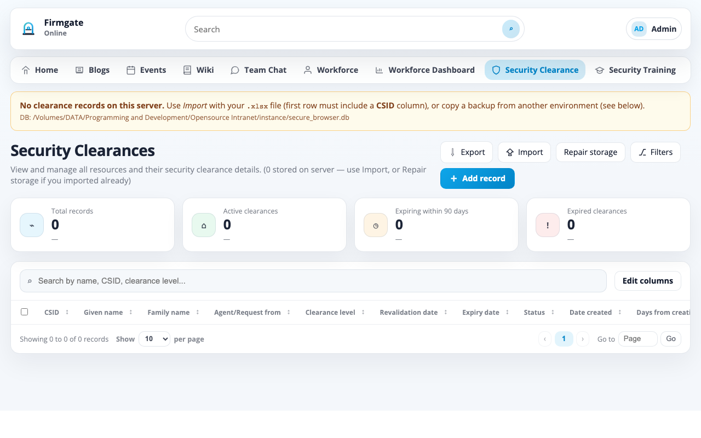
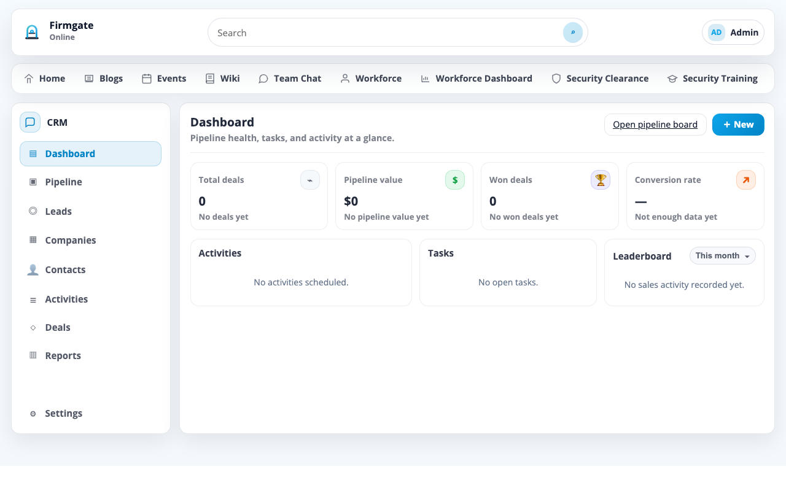

# Firmgate

**Self-hosted intranet and ERP-style internal platform** — run it on your own servers or private cloud, with your data, your branding, and no SaaS lock-in.

Firmgate is an open-source alternative to cloud employee portals and a tangle of separate internal tools. It combines intranet features (news, wiki, chat, documents) with operational modules (CRM, workforce directory, security clearance, timesheets-style workflows, and administration) in **one deployable stack**. You control where it runs, who can access it, and how it integrates with Office 365, LDAP, and email.

Built with Flask, with role-based access control, optional MFA, and integrations for document editing and outbound mail.


### Why self-hosted?

| Perk | What it means |
|------|----------------|
| **Your infrastructure** | SQLite (or your DB), uploads, and config live on **your** machine — not a vendor’s multi-tenant cloud |
| **One system** | Intranet + documents + CRM + workforce + compliance modules in a single app, instead of many subscriptions |
| **Air-gap friendly** | Suitable for LAN-only, VPN, or regulated environments where data must not leave the network |
| **No per-seat cloud tax** | Scale users on hardware you already pay for; optional commercial support later without mandatory SaaS |
| **Full admin control** | Users, roles, modules, backups, factory reset, and branding from **Administration** |

---

## What you get

| Area | Highlights |
|------|------------|
| **Home** | Configurable landing page and news |
| **Blogs** | Internal posts (admin authoring) |
| **Events** | Shared calendar (day / month / year), public holidays |
| **Wiki** | Internal knowledge base with sanitised HTML |
| **Team Chat** | Rooms, messaging, optional WebRTC voice |
| **Workforce** | Employee directory, presence, admin editing |
| **Documents** | Folders, uploads, sharing, PDF/image/EML viewers, Office editing |
| **CRM** | Leads, pipeline, companies, activities |
| **Security** | Clearance records, training library, officer reports |
| **About** | Editable company profile |
| **Administration** | Users, groups, roles, modules, integrations, backups, branding |

Modules can be enabled, restricted, or hidden per user from **Administration → Modules**.

---

## Screenshots

Visual tour of Firmgate (demo data shown in some views). Each shot includes the default Firmgate logo and header label.

### Home

Configurable landing page with announcements and an editable hero section for administrators.


### Blogs

Internal blog posts with categories; authors with permission can create new entries.


### Team Chat

Chat rooms, member management, shared files, and optional voice calls.


### Security Clearance

Track clearance levels, expiry, import/export, and compliance summaries.



### Documents

Folder tree, uploads, sharing, favourites, and in-browser previews for common file types.


### CRM

Pipeline dashboard, leads, companies, contacts, activities, and deals.



### Games

Built-in games (Chess, Lemmings, Sky Control) for informal team engagement.


### Administration

User, group, and role management; integrations; backups; portal branding; and module toggles.


---

## Requirements

### Server / development machine

| Requirement | Notes |
|-------------|--------|
| **Python 3.10+** | 3.11 recommended |
| **Git** | Clone and deploy updates |
| **SQLite** | Default database (included with Python) |
| **Disk space** | Depends on document uploads (`UPLOAD_ROOT`) |
| **Docker** (Option 1) | Docker Engine + Docker Compose v2 |

### Python dependencies

Install from `requirements.txt` (Flask, SQLAlchemy, LDAP client, MFA, document libraries, etc.).

Production also uses **Gunicorn** (installed automatically by `scripts/update.sh` if missing).

### Optional (by feature)

| Feature | What you need |
|---------|----------------|
| **HTTPS reverse proxy** | nginx, Caddy, or similar (strongly recommended in production) |
| **OnlyOffice** | ONLYOFFICE Document Server + public URLs for callbacks |
| **Microsoft 365 editing** | Azure app registration with Graph permissions |
| **Outbound email** | SMTP (custom, Microsoft 365, or Google Workspace) |
| **LDAP / AD** | Directory server for future SSO/sync integrations |
| **Large uploads** | Tune `MAX_UPLOAD_MB` and proxy `client_max_body_size` |

---

## Default administrator (factory bootstrap)

On a **fresh install** (empty database), the app creates one bootstrap administrator:

| Field | Value |
|-------|--------|
| **Email** | `admin@example.com` |
| **Password** | `admin` |

This account exists so you can sign in immediately and configure the portal. **Change this password before going to production.**

### Automatic deactivation

The bootstrap account is a *temporary* entry point, not a permanent second admin.

Once **any other active user** has full administration rights (`admin.all`), the bootstrap account is **automatically deactivated** (`is_active = false`). You can still see it in **Administration → Users** (marked as factory bootstrap); it cannot sign in until an administrator re-enables it.

This runs whenever users or role permissions are saved — for example after you:

1. Sign in as `admin@example.com`
2. Open **Administration → Users**
3. Create your real administrator account and assign the **admin** role (or any role that includes `admin.all`)
4. Sign out and sign in as the new account

The factory account is then disabled; use your real admin account from that point on.

> **Factory reset** restores the same bootstrap credentials on a wiped portal. See [Backup and factory reset](#backup-and-factory-reset) below.

---

## Install Firmgate

Two supported ways to deploy: **Docker Compose** (fastest) or a **release ZIP** (air-gap, no Git on the server). After either install, sign in with the [bootstrap admin](#default-administrator-factory-bootstrap), create your real administrator, and change passwords before production use.

### Option 1 — Docker Compose (recommended)

Runs Firmgate in a container with Gunicorn. SQLite and uploads persist in a named Docker volume.

**Requirements:** Docker Engine and Docker Compose v2.

```bash
git clone https://github.com/snooth/firmgate.git
cd firmgate
cp .env.example .env
# Edit .env — set SECRET_KEY (openssl rand -hex 32). Compose reads .env for ${VAR} substitution.
docker compose up -d --build
```

Open **http://127.0.0.1:5001/** (or the host port from `FIRMGATE_HTTP_PORT` in `.env`).

| Item | Location |
|------|----------|
| App code | Inside the `firmgate` container image |
| Database + uploads | Docker volume `firmgate_data` → `/data/instance` in the container |
| Secrets / config | `.env` on the host (loaded by Compose) |

Useful commands:

```bash
docker compose logs -f firmgate    # follow logs
docker compose ps                  # health status
docker compose down                # stop (data kept in volume)
docker compose up -d --build       # rebuild after git pull
```

Put **nginx** or **Caddy** in front of the published port for HTTPS in production. The container exposes a health check on `/health`.

To back up data, copy the volume contents or use **Administration → Backup and restore** inside the app.

### Option 2 — Release ZIP (no Git on the server)

For servers without Git access or regulated networks: build a ZIP on a machine with the repo, copy it to the server, then install or upgrade through the admin UI.

#### Build the package (maintainer or CI)

From a clone of this repository:

```bash
./scripts/build_release_package.sh
```

Output: `dist/firmgate-release-<version>-<timestamp>.zip` containing a `firmgate/` folder with source, `requirements.txt`, `manifest.json`, and `checksums.sha256.json`.

#### First install from ZIP

1. Unzip on the server, e.g. `/opt/firmgate`
2. Create `.env` from `.env.example` and set `SECRET_KEY`, `DATABASE_URL`, and `UPLOAD_ROOT`
3. Create a virtual environment and install dependencies:

```bash
cd /opt/firmgate
python3 -m venv .venv
.venv/bin/pip install --upgrade pip
.venv/bin/pip install -r requirements.txt
.venv/bin/python -c "from app import create_app; create_app()"
```

4. Run with Gunicorn (or use the [production systemd](#production-deployment-start-to-finish) steps)

```bash
.venv/bin/gunicorn --bind 127.0.0.1:5001 --workers 2 --timeout 300 "run:app"
```

#### Upgrade an existing server from ZIP

When Git pull is not available, enable package upgrades and upload the ZIP:

1. Ensure `ENABLE_SOFTWARE_PACKAGE_UPGRADE=1` in `.env` (default)
2. Sign in as an administrator → **Administration → Software version**
3. Choose **Upgrade from package** and upload `firmgate-release-*.zip`

The server keeps `instance/`, `.env`, and `.venv`, runs `pip install -r requirements.txt`, takes a light backup, and restarts the configured systemd service (`SOFTWARE_UPGRADE_SERVICE_NAME`, default `intranet`). Legacy packages tagged `intranet-release-package` are still accepted.

---

## Quick start (local development)

Follow these steps from an empty machine to a running portal on your laptop.

### 1. Clone the repository

```bash
git clone https://github.com/snooth/firmgate.git
cd firmgate
```

### 2. Create a virtual environment and install dependencies

```bash
python3 -m venv .venv
source .venv/bin/activate   # Windows: .venv\Scripts\activate
python -m pip install --upgrade pip
python -m pip install -r requirements.txt
```

### 3. Configure secrets (recommended even for dev)

Create a `.env` file in the repo root (gitignored):

```bash
cat > .env <<'EOF'
SECRET_KEY=replace-with-a-long-random-string
FLASK_DEBUG=1
EOF
```

Or export variables in your shell — see [Configuration](#configuration).

### 4. Run the development server

```bash
source .venv/bin/activate
python run.py
```

Open **http://127.0.0.1:5001/** (port overridable with `PORT=8080 python run.py`).

On first start the app creates `instance/secure_browser.db` and the bootstrap admin if the database has no users.

### 5. Sign in and secure the portal

1. Sign in with **`admin@example.com`** / **`admin`**
2. Go to **Administration → Users** and create your real administrator
3. Assign the **admin** role (includes `admin.all`)
4. Sign in as the new user — the bootstrap account is deactivated automatically
5. Configure **Integrations**, **Email**, **Portal customisation**, and **Modules** as needed

Optional: run `python seed_data.py` on an empty database if you prefer an explicit seed step (same bootstrap user, no demo data).

---

## Using the application

### Navigation

After sign-in, the top bar lists modules your account may access. Availability depends on **roles/permissions** and **Administration → Modules** settings.

Typical workflow for end users:

1. **Home** — announcements and links configured by admins  
2. **Documents** — upload, organise, share, and open files (Office formats use OnlyOffice or Microsoft 365 when configured)  
3. **Events** — view or create calendar entries (if permitted)  
4. **Team Chat** — join rooms and message colleagues  
5. **Workforce** — find people and org details  

Power users and module owners use **CRM**, **Wiki**, **Security Training**, **Resource Pool**, etc., according to their permissions.

### Roles and permissions

Built-in roles include **Standard**, **Power**, and **admin**. Fine-grained permissions (`documents.read`, `wiki.write`, `admin.all`, …) are managed under **Administration → Roles & permissions**.

Users can belong to **groups**; group roles grant permissions in bulk.

### Administration (portal owners)

Open **Administration** from the main nav (requires `admin.all` or user-management permissions). Common tasks:

| Section | Purpose |
|---------|---------|
| **Users / Groups / Roles** | Accounts and access control |
| **Registrations** | Approve self-service sign-ups (Extranet theme) |
| **Integrations** | OnlyOffice, Microsoft 365, LDAP |
| **Email Settings** | Outbound SMTP |
| **Portal customisation** | Logo, theme, home content |
| **Modules** | Show/hide/restrict nav items |
| **Backup and restore** | Download zip backup, restore, factory reset |
| **Software version** | Git or package upgrade (when enabled) |

### Documents and editing

- Upload via **Documents → + New** or drag-and-drop  
- Share folders/files with colleagues (permission permitting)  
- Office files open in an embedded editor when **OnlyOffice** or **Microsoft 365** is configured under **Integrations → Document editor**  
- PDFs, images, and `.eml` email open in built-in viewers  

### End-user documentation

A generic user manual lives in [`docs/User_Manual.html`](docs/User_Manual.html). Regenerate figures or Word export with:

```bash
python3 scripts/generate_manual_figure_images.py
python3 scripts/build_user_manual_docx.py
```

---

## Production deployment (start to finish)

This section walks from a fresh Linux server to a systemd-managed deployment behind HTTPS. Adjust paths and domain names for your environment.

### Overview

```
Internet → nginx (TLS) → Gunicorn → Flask app
                              ↓
                    instance/ (SQLite + uploads)
                    .env (secrets)
```

Keep **code** (git checkout) separate from **runtime data** (`instance/`, `.env`) so updates never wipe documents or settings.

Recommended layout (used by `scripts/update.sh`):

| Path | Purpose |
|------|---------|
| `/root/intranet` | Git checkout (application code) |
| `/root/intranet_instance` | Database + uploads (symlinked as `intranet/instance/`) |
| `/root/intranet-backups` | Timestamped `.env` + DB backups before upgrades |
| `/etc/intranet-update.conf` | Optional override for update script |

### Step 1 — System packages

```bash
sudo apt update
sudo apt install -y python3 python3-venv python3-pip git nginx
```

### Step 2 — Clone the application

```bash
sudo mkdir -p /root/intranet
sudo git clone https://github.com/snooth/firmgate.git /root/intranet
cd /root/intranet
```

### Step 3 — External instance directory (recommended)

```bash
sudo mkdir -p /root/intranet_instance/uploads
sudo ln -sfn /root/intranet_instance /root/intranet/instance
```

### Step 4 — Environment file

```bash
sudo tee /root/intranet/.env <<'EOF'
SECRET_KEY=CHANGE-ME-use-openssl-rand-hex-32
FLASK_DEBUG=0
DATABASE_URL=sqlite:////root/intranet_instance/secure_browser.db
UPLOAD_ROOT=/root/intranet_instance/uploads
MAX_UPLOAD_MB=4096
EOF
```

Generate a secret:

```bash
openssl rand -hex 32
```

### Step 5 — Virtual environment and dependencies

```bash
cd /root/intranet
python3 -m venv .venv
.venv/bin/pip install --upgrade pip
.venv/bin/pip install -r requirements.txt
.venv/bin/pip install gunicorn
```

### Step 6 — Initialise the database

Start once so `create_all()` runs and the bootstrap admin is created:

```bash
cd /root/intranet
.venv/bin/python -c "from app import create_app; create_app()"
```

Or run briefly:

```bash
.venv/bin/python run.py &
sleep 3
kill %1
```

### Step 7 — systemd service

Create `/etc/systemd/system/intranet.service`:

```ini
[Unit]
Description=Firmgate (Gunicorn)
After=network.target

[Service]
User=root
Group=root
WorkingDirectory=/root/intranet
EnvironmentFile=/root/intranet/.env
ExecStart=/root/intranet/.venv/bin/gunicorn \
  --workers 2 \
  --bind 127.0.0.1:5001 \
  --timeout 300 \
  "run:app"
Restart=on-failure
RestartSec=5

[Install]
WantedBy=multi-user.target
```

Enable and start:

```bash
sudo systemctl daemon-reload
sudo systemctl enable intranet
sudo systemctl start intranet
sudo systemctl status intranet
```

> Increase `--workers` on multi-core hosts. For SQLite, avoid very high worker counts on heavy write loads.

### Step 8 — nginx reverse proxy (example)

Replace `intranet.example.com` with your hostname. Example `/etc/nginx/sites-available/intranet`:

```nginx
server {
    listen 80;
    server_name intranet.example.com;
    return 301 https://$host$request_uri;
}

server {
    listen 443 ssl http2;
    server_name intranet.example.com;

    ssl_certificate     /etc/ssl/certs/intranet.crt;
    ssl_certificate_key /etc/ssl/private/intranet.key;

    client_max_body_size 4096m;

    location / {
        proxy_pass http://127.0.0.1:5001;
        proxy_set_header Host $host;
        proxy_set_header X-Real-IP $remote_addr;
        proxy_set_header X-Forwarded-For $proxy_add_x_forwarded_for;
        proxy_set_header X-Forwarded-Proto $scheme;
        proxy_read_timeout 300s;
    }
}
```

```bash
sudo ln -s /etc/nginx/sites-available/intranet /etc/nginx/sites-enabled/
sudo nginx -t && sudo systemctl reload nginx
```

Use **certbot** or your CA for real TLS certificates.

### Step 9 — First login on production

1. Browse to `https://intranet.example.com`
2. Sign in with **`admin@example.com`** / **`admin`**
3. Create your real admin user, assign **admin** role, sign in as that user
4. Configure integrations (set **App public URL** to your HTTPS origin for OnlyOffice)
5. Upload a logo under **Portal customisation**
6. Disable or delete the factory bootstrap user if it remains visible (it should auto-deactivate)

### Step 10 — Install the safe update script

```bash
sudo cp /root/intranet/scripts/root-update.sh /root/update.sh
sudo chmod +x /root/update.sh
```

Optional: copy `scripts/update.conf.example` to `/etc/intranet-update.conf` (default `REPO_URL` is `https://github.com/snooth/firmgate.git`).

---

## Updating production

From your **development machine**, commit and push:

```bash
./upload.sh "Describe your changes"
```

On the **server** (run from `/root`, not inside the app tree):

```bash
sudo /root/update.sh
```

The update script:

1. Links external `instance/` if configured  
2. Light backup of `.env` and SQLite DB to `/root/intranet-backups/<timestamp>/`  
3. `git fetch` + hard reset to `origin/main`  
4. `pip install -r requirements.txt` (and Gunicorn if needed)  
5. Restarts the `intranet` systemd unit  
6. Verifies upload file counts did not drop  

Useful flags:

```bash
sudo /root/update.sh --dry-run          # print steps only
sudo /root/update.sh --recreate-venv    # rebuild .venv
sudo /root/update.sh --full             # fresh clone + directory swap
sudo /root/update.sh --no-backup        # skip pre-update backup
sudo /root/update.sh --backup-full      # rsync entire instance/ (slow)
```

---

## Configuration

Defaults live in [`config.py`](config.py). Override with environment variables or `.env` (loaded when present).

| Variable | Purpose | Default |
|----------|---------|---------|
| `SECRET_KEY` | Flask session signing | `dev-change-me-in-production` |
| `FLASK_DEBUG` / `DEBUG` | Debug mode | off |
| `DATABASE_URL` | SQLAlchemy URI | `sqlite:///instance/secure_browser.db` |
| `UPLOAD_ROOT` | Document blob storage | `instance/uploads` |
| `MAX_UPLOAD_MB` | Max upload size per request | `4096` |
| `PORT` | Dev server port (`run.py`) | `5001` |
| `MFA_ISSUER` | Name shown in authenticator apps | `Firmgate` |
| `PORTAL_PRODUCT_NAME` | Default header / shell name (core theme) | `Firmgate` |
| `ONLYOFFICE_APP_URL` | Public base URL for Document Server callbacks | (empty → request root) |
| `ENABLE_SOFTWARE_GIT_UPGRADE` | Admin Git upgrade API | enabled |
| `ENABLE_SOFTWARE_PACKAGE_UPGRADE` | Admin zip package upgrade | enabled |
| `DEPLOY_ROOT` | Git root for in-app upgrade | `/root/intranet` when present |
| `SOFTWARE_UPGRADE_SERVICE_NAME` | systemd unit to restart after upgrade | `intranet` |
| `VOICE_CALL_MODE` | Team Chat voice: `webrtc` or `jitsi` | `webrtc` |
| `WEBRTC_STUN_URL` | STUN server for WebRTC | Google public STUN |

Example `.env` for local development:

```bash
SECRET_KEY=local-dev-secret-change-me
DATABASE_URL=sqlite:////absolute/path/to/instance/secure_browser.db
UPLOAD_ROOT=/absolute/path/to/instance/uploads
MAX_UPLOAD_MB=4096
```

---

## Integrations

Configure under **Administration → Integrations** (and related tabs).

### Document editor (OnlyOffice or Microsoft 365)

Choose the active editor, then configure the matching block:

- **OnlyOffice** — Document Server URL, JWT secret (if enabled on DS), **App public URL** (must be reachable from the Document Server)  
- **Microsoft 365** — Azure tenant, app ID, client secret, SharePoint site; requires Graph application permissions  

Without a configured editor, Office files can still be downloaded; embedded editing routes return 404.

### Email

**Administration → Email Settings** — SMTP provider, from address, enable/disable outbound mail.

### LDAP / Active Directory

Stored for future bridges; **Test** verifies bind and search settings.

---

## Backup and factory reset

**Administration → Backup and restore**

| Action | Effect |
|--------|--------|
| **Download backup** | Zip of SQLite DB, uploads, branding |
| **Restore** | Replace DB/uploads from zip (destructive) |
| **Factory reset** | Wipes portal data; restores bootstrap admin `admin@example.com` / `admin` |
| **Add demo data** | Seeds ~20% sample content per module (development only) |

Factory reset requires typing `FACTORY RESET` to confirm. Download a backup first if you might need existing data.

---

## Database and schema changes

The app uses `db.create_all()` on startup plus lightweight SQLite column helpers in `app/__init__.py` (`ALTER TABLE … ADD COLUMN`). No Alembic migration stack is bundled — for PostgreSQL or complex schema evolution, add Alembic or manage migrations separately.

---

## Troubleshooting

| Symptom | What to check |
|---------|----------------|
| **Cannot sign in as bootstrap admin** | Another active admin may have deactivated it; use your real admin account or factory reset |
| **Upload HTTP 413** | Raise `MAX_UPLOAD_MB` and nginx `client_max_body_size` |
| **OnlyOffice won’t open/save** | App public URL must be HTTPS and reachable from Document Server; JWT secrets must match |
| **Microsoft 365 test fails** | Graph permissions, admin consent, SharePoint site hostname/path |
| **Factory reset fails** | Restart the app server so all workers release SQLite; retry |
| **SQLAlchemy mapper errors** | Usually a broken model relationship — see traceback model name |
| **Service won’t start after update** | `journalctl -u intranet -n 50`; try `--recreate-venv` |
| **Docker container unhealthy** | `docker compose logs firmgate`; confirm `SECRET_KEY` is set in `.env` |
| **Package upgrade rejected** | ZIP must include `firmgate/manifest.json` with tag `firmgate-release-package` |

---

## Repository layout

```
app/                 Flask application (blueprints, models, templates, static)
config.py            Default configuration
run.py               Development entrypoint (also used as Gunicorn `run:app`)
Dockerfile           Container image (Option 1)
docker-compose.yml   Docker Compose stack (Option 1)
.env.example         Sample environment file (copy to .env)
seed_data.py         Optional explicit seed (bootstrap admin only)
requirements.txt     Python dependencies
scripts/             update.sh, build_release_package.sh, docker-entrypoint.sh, …
instance/            Runtime data (gitignored): DB, uploads, branding
docs/                User manual, screenshots, and reference images
docs/screenshots/    README gallery with Firmgate branding (home, blogs, chat, CRM, etc.)
LICENSE              Apache 2.0 — Community Edition
COMMERCIAL.md        Optional enterprise / support terms (not required to self-host)
```

---

## Tech stack

- **Backend:** Flask, Flask-Login, Flask-SQLAlchemy  
- **Database:** SQLite (default)  
- **Frontend:** Jinja2 templates, vanilla JavaScript  
- **Production:** Gunicorn + nginx (recommended)  

---

## License

**Community Edition** is licensed under the [Apache License 2.0](LICENSE).

Optional paid support, hosting, and enterprise add-ons are described in [COMMERCIAL.md](COMMERCIAL.md). The Apache License allows free self-hosting; commercial terms apply only to separate offerings you choose to purchase.
